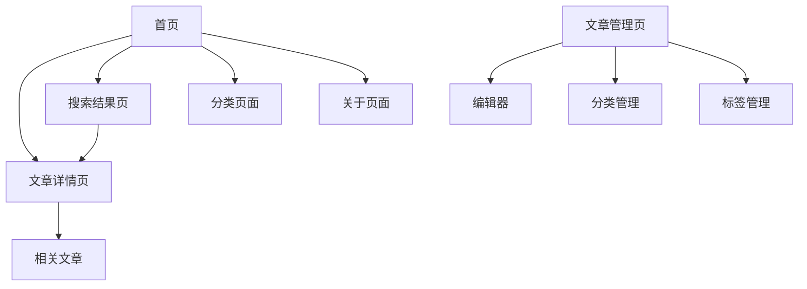

# Vue3 专业博客系统需求文档

## 1. 产品概述

一个面向资深前端开发工程师的现代化博客系统，采用Vue3+TypeScript+Vite+Pinia+Element Plus技术栈构建。

系统旨在为6年经验的前端开发者提供一个专业、美观、功能完善的个人博客平台，展现技术深度和开发灵性。

目标是打造一个具有现代化设计理念、优秀用户体验和高性能表现的技术博客平台。

## 2. 核心功能

### 2.1 用户角色

| 角色 | 注册方式 | 核心权限 |
|------|----------|----------|
| 博主 | 默认管理员账户 | 文章发布、编辑、删除，分类管理，系统配置 |
| 访客 | 无需注册 | 浏览文章、搜索、评论查看 |

### 2.2 功能模块

我们的博客系统包含以下核心页面：

1. **首页**：导航栏、英雄区块、文章列表、分类标签、搜索功能
2. **文章详情页**：文章内容展示、代码高亮、目录导航、相关推荐
3. **文章管理页**：文章编辑器、Markdown支持、草稿保存、发布管理
4. **分类管理页**：分类创建、编辑、文章归类
5. **标签管理页**：标签云、标签关联、热门标签
6. **搜索结果页**：全文搜索、筛选排序、高亮显示
7. **关于页面**：个人简介、技能展示、联系方式

### 2.3 页面详情

| 页面名称 | 模块名称 | 功能描述 |
|----------|----------|----------|
| 首页 | 导航栏 | 响应式导航菜单，包含主要页面链接、搜索框、主题切换 |
| 首页 | 英雄区块 | 个人介绍、技术标签云、社交媒体链接、动态背景效果 |
| 首页 | 文章列表 | 分页展示文章卡片，包含标题、摘要、标签、发布时间、阅读量 |
| 首页 | 侧边栏 | 热门文章、分类导航、标签云、最新评论 |
| 文章详情页 | 文章内容 | Markdown渲染、代码语法高亮、图片懒加载、文章目录 |
| 文章详情页 | 互动区域 | 点赞、分享、评论展示、相关文章推荐 |
| 文章管理页 | 编辑器 | Markdown编辑器、实时预览、图片上传、草稿自动保存 |
| 文章管理页 | 文章列表 | 文章状态管理、批量操作、搜索筛选 |
| 分类管理页 | 分类树 | 层级分类管理、拖拽排序、文章数量统计 |
| 标签管理页 | 标签云 | 标签热度可视化、颜色编码、快速筛选 |
| 搜索结果页 | 搜索结果 | 全文搜索、关键词高亮、按相关度排序 |
| 关于页面 | 个人展示 | 技能雷达图、项目展示、工作经历时间线 |

## 3. 核心流程

**博主管理流程：**
博主登录后台 → 文章管理页面 → 创建/编辑文章 → 设置分类标签 → 发布文章 → 首页展示

**访客浏览流程：**
访问首页 → 浏览文章列表 → 点击文章详情 → 阅读文章内容 → 查看相关推荐

**搜索流程：**
首页搜索框 → 输入关键词 → 搜索结果页 → 筛选排序 → 查看匹配文章

## 4. 用户界面设计

### 4.1 设计风格

- **主色调**：深蓝色 (#1e3a8a) 和亮蓝色 (#3b82f6)，体现专业技术感
- **辅助色**：灰色系 (#64748b, #f1f5f9) 用于背景和文本
- **强调色**：橙色 (#f59e0b) 用于重要按钮和链接
- **按钮风格**：圆角设计，悬停渐变效果，阴影层次
- **字体**：Inter 主字体，JetBrains Mono 代码字体，16px 基础字号
- **布局风格**：卡片式设计，网格布局，充足留白，现代极简风格
- **图标风格**：线性图标，统一风格，适当动画效果

### 4.2 页面设计概览

| 页面名称 | 模块名称 | UI元素 |
|----------|----------|--------|
| 首页 | 导航栏 | 固定顶部导航，毛玻璃效果，响应式汉堡菜单，搜索框动画 |
| 首页 | 英雄区块 | 全屏渐变背景，动态粒子效果，打字机文字动画，技能标签浮动 |
| 首页 | 文章列表 | 卡片网格布局，悬停阴影效果，标签彩色标记，无限滚动加载 |
| 文章详情页 | 内容区域 | 单栏布局，代码块深色主题，目录悬浮导航，进度条指示 |
| 文章管理页 | 编辑器 | 分屏布局，工具栏固定，Markdown语法高亮，实时字数统计 |
| 搜索结果页 | 结果展示 | 列表布局，关键词高亮，筛选侧边栏，分页导航 |

### 4.3 响应式设计

桌面优先的响应式设计，支持移动端适配和触摸交互优化。断点设置：1200px（大屏）、768px（平板）、480px（手机）。