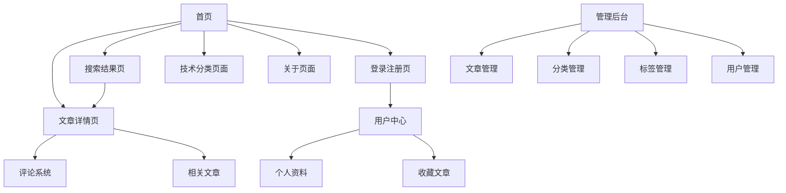

# Vue3 专业博客系统需求文档

## 1. 产品概述

一个面向资深前端开发工程师的现代化博客系统，采用Vue3+TypeScript+Vite+Pinia+Element Plus技术栈构建。

系统旨在为6年经验的前端开发者提供一个专业、美观、功能完善的个人博客平台，展现技术深度和开发灵性。

目标是打造一个具有现代化设计理念、优秀用户体验和高性能表现的技术博客平台。

## 2. 核心功能

### 2.1 用户角色

| 角色 | 注册方式 | 核心权限 |
|------|----------|----------|
| 管理员 | 系统预设账户 | 全部权限：文章发布、编辑、删除，分类管理，用户管理，系统配置 |
| 注册用户 | 邮箱注册/第三方登录 | 发表评论、收藏文章、个人资料管理、文章投稿 |
| 访客 | 无需注册 | 浏览文章、搜索内容 |

### 2.2 功能模块

我们的博客系统包含以下核心页面：

1. **首页**：导航栏、英雄区块、文章列表、分类标签、搜索功能、热门标签展示
2. **文章详情页**：文章内容展示、代码高亮、目录导航、相关推荐、评论系统
3. **登录注册页**：用户登录、注册、密码重置、第三方登录集成
4. **用户中心页**：个人资料、收藏文章、评论历史、账户设置
5. **文章管理页**：文章编辑器、Markdown支持、草稿保存、发布管理
6. **分类管理页**：技术分类管理（前端、后端、算法、人工智能等）
7. **标签管理页**：标签云、标签关联、热门标签统计
8. **搜索结果页**：全文搜索、筛选排序、高亮显示
9. **关于页面**：个人简介、技能展示、联系方式

### 2.3 页面详情

| 页面名称 | 模块名称 | 功能描述 |
|----------|----------|----------|
| 首页 | 导航栏 | 响应式导航菜单，包含主要页面链接、搜索框、主题切换 |
| 首页 | 英雄区块 | 个人介绍、技术标签云、社交媒体链接、动态背景效果 |
| 首页 | 文章列表 | 分页展示文章卡片，包含标题、摘要、标签、发布时间、阅读量 |
| 首页 | 侧边栏 | 热门文章、技术分类导航（前端/后端/算法/AI）、热门标签云、最新评论 |
| 登录注册页 | 登录表单 | 邮箱/用户名登录、密码输入、记住登录、忘记密码链接 |
| 登录注册页 | 注册表单 | 用户信息填写、邮箱验证、密码强度检测、用户协议确认 |
| 登录注册页 | 第三方登录 | GitHub/Google OAuth登录、快速注册选项 |
| 用户中心页 | 个人资料 | 头像上传、基本信息编辑、技能标签、社交链接 |
| 用户中心页 | 用户操作 | 收藏文章列表、评论历史、账户设置、退出登录 |
| 文章详情页 | 文章内容 | Markdown渲染、代码语法高亮、图片懒加载、文章目录 |
| 文章详情页 | 互动区域 | 点赞、分享、评论展示、相关文章推荐 |
| 文章管理页 | 编辑器 | Markdown编辑器、实时预览、图片上传、草稿自动保存 |
| 文章管理页 | 文章列表 | 文章状态管理、批量操作、搜索筛选 |
| 分类管理页 | 技术分类 | 前端开发、后端开发、算法与数据结构、人工智能、DevOps等分类管理 |
| 标签管理页 | 标签云 | 标签热度可视化、颜色编码、快速筛选 |
| 搜索结果页 | 搜索结果 | 全文搜索、关键词高亮、按相关度排序 |
| 关于页面 | 个人展示 | 技能雷达图、项目展示、工作经历时间线 |

## 3. 核心流程

**用户注册登录流程：**
访问登录页 → 选择注册/登录 → 填写信息/验证 → 登录成功 → 跳转用户中心

**管理员管理流程：**
管理员登录 → 文章管理页面 → 创建/编辑文章 → 设置技术分类标签 → 发布文章 → 首页展示

**注册用户流程：**
登录账户 → 浏览文章 → 发表评论 → 收藏文章 → 管理个人资料

**访客浏览流程：**
访问首页 → 浏览技术分类 → 点击文章详情 → 阅读内容 → 查看相关推荐

**搜索流程：**
首页搜索框 → 输入关键词 → 搜索结果页 → 筛选排序 → 查看匹配文章

## 4. 用户界面设计

### 4.1 设计风格

- **主色调**：深蓝色 (#1e3a8a) 和亮蓝色 (#3b82f6)，体现专业技术感
- **辅助色**：灰色系 (#64748b, #f1f5f9) 用于背景和文本
- **强调色**：橙色 (#f59e0b) 用于重要按钮和链接
- **按钮风格**：圆角设计，悬停渐变效果，阴影层次
- **字体**：Inter 主字体，JetBrains Mono 代码字体，16px 基础字号
- **布局风格**：卡片式设计，网格布局，充足留白，现代极简风格
- **图标风格**：线性图标，统一风格，适当动画效果

### 4.2 页面设计概览

| 页面名称 | 模块名称 | UI元素 |
|----------|----------|--------|
| 首页 | 导航栏 | 固定顶部导航，毛玻璃效果，用户登录状态显示，退出登录按钮 |
| 首页 | 英雄区块 | 全屏渐变背景，动态粒子效果，技术分类快速导航 |
| 首页 | 文章列表 | 卡片网格布局，悬停阴影效果，技术分类标签彩色编码 |
| 首页 | 侧边栏 | 热门标签云（非空数据），技术分类导航，最新评论 |
| 登录注册页 | 表单设计 | 居中卡片布局，渐变背景，表单验证提示，加载动画 |
| 用户中心页 | 个人面板 | 卡片式布局，头像展示，操作按钮清晰可见 |
| 文章详情页 | 内容区域 | 单栏布局，代码块深色主题，评论区域，社交分享 |
| 文章管理页 | 操作按钮 | 删除按钮完全可见，悬停效果，确认对话框 |
| 分类管理页 | 技术分类 | 前端/后端/算法/AI分类卡片，图标标识，文章数量统计 |

### 4.3 响应式设计

桌面优先的响应式设计，支持移动端适配和触摸交互优化。断点设置：1200px（大屏）、768px（平板）、480px（手机）。