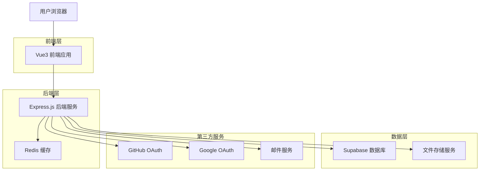
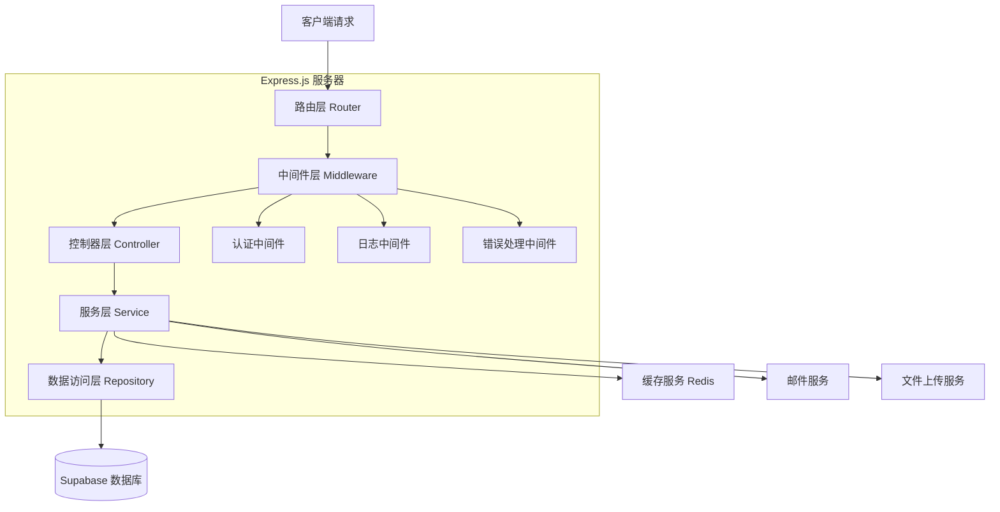
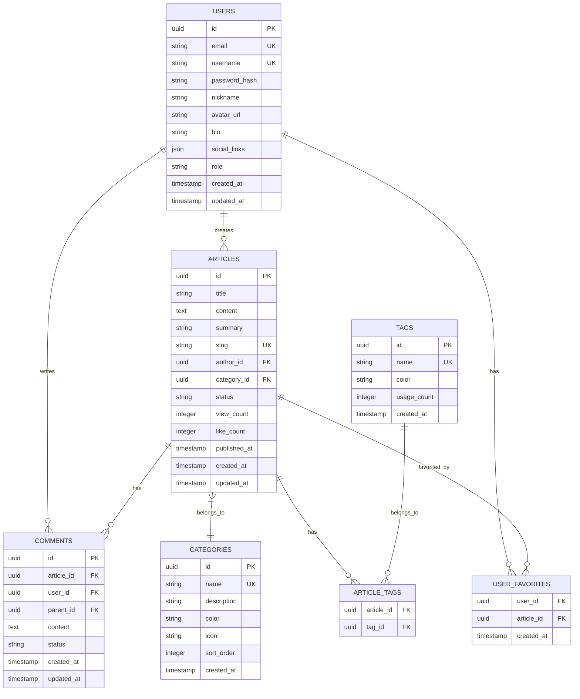

# Vue3 博客系统技术架构文档

## 1. 架构设计



## 2. 技术描述

- **前端**: Vue3@3 + TypeScript + Vite + Pinia + Element Plus + TailwindCSS
- **后端**: Express.js@4 + TypeScript + JWT认证 + bcrypt密码加密
- **数据库**: Supabase (PostgreSQL) + Redis缓存
- **认证**: JWT + OAuth2.0 (GitHub/Google)
- **文件存储**: Supabase Storage
- **部署**: GitHub Pages (前端) + Railway/Vercel (后端)

## 3. 路由定义

| 路由 | 用途 |
|------|------|
| / | 首页，展示文章列表和技术分类 |
| /login | 登录页面，支持邮箱和第三方登录 |
| /register | 注册页面，用户注册和邮箱验证 |
| /profile | 用户中心，个人资料和账户管理 |
| /article/:id | 文章详情页，展示文章内容和评论 |
| /category/:name | 技术分类页面（前端/后端/算法/AI） |
| /search | 搜索结果页面，全文搜索功能 |
| /admin | 管理后台，文章和用户管理 |
| /admin/articles | 文章管理页面，CRUD操作 |
| /admin/categories | 分类管理页面 |
| /admin/tags | 标签管理页面 |
| /about | 关于页面，个人简介和联系方式 |

## 4. API定义

### 4.1 用户认证相关

**用户注册**
```
POST /api/auth/register
```

请求参数:
| 参数名 | 参数类型 | 是否必需 | 描述 |
|--------|----------|----------|------|
| email | string | true | 用户邮箱 |
| password | string | true | 用户密码 |
| username | string | true | 用户名 |
| nickname | string | false | 昵称 |

响应:
| 参数名 | 参数类型 | 描述 |
|--------|----------|------|
| success | boolean | 注册是否成功 |
| message | string | 响应消息 |
| token | string | JWT令牌 |

**用户登录**
```
POST /api/auth/login
```

请求参数:
| 参数名 | 参数类型 | 是否必需 | 描述 |
|--------|----------|----------|------|
| email | string | true | 用户邮箱 |
| password | string | true | 用户密码 |

响应:
| 参数名 | 参数类型 | 描述 |
|--------|----------|------|
| success | boolean | 登录是否成功 |
| token | string | JWT令牌 |
| user | object | 用户信息 |

### 4.2 文章相关API

**获取文章列表**
```
GET /api/articles
```

查询参数:
| 参数名 | 参数类型 | 是否必需 | 描述 |
|--------|----------|----------|------|
| page | number | false | 页码，默认1 |
| limit | number | false | 每页数量，默认10 |
| category | string | false | 分类筛选 |
| tag | string | false | 标签筛选 |

**创建文章**
```
POST /api/articles
```

请求参数:
| 参数名 | 参数类型 | 是否必需 | 描述 |
|--------|----------|----------|------|
| title | string | true | 文章标题 |
| content | string | true | 文章内容(Markdown) |
| summary | string | false | 文章摘要 |
| category_id | number | true | 分类ID |
| tags | array | false | 标签数组 |
| status | string | false | 发布状态(draft/published) |

### 4.3 评论相关API

**获取文章评论**
```
GET /api/articles/:id/comments
```

**发表评论**
```
POST /api/articles/:id/comments
```

请求参数:
| 参数名 | 参数类型 | 是否必需 | 描述 |
|--------|----------|----------|------|
| content | string | true | 评论内容 |
| parent_id | number | false | 父评论ID（回复） |

## 5. 服务器架构图



## 6. 数据模型

### 6.1 数据模型定义



### 6.2 数据定义语言

**用户表 (users)**
```sql
CREATE TABLE users (
  id UUID PRIMARY KEY DEFAULT gen_random_uuid(),
  email VARCHAR(255) UNIQUE NOT NULL,
  username VARCHAR(50) UNIQUE NOT NULL,
  password_hash VARCHAR(255) NOT NULL,
  nickname VARCHAR(100),
  avatar_url TEXT,
  bio TEXT,
  social_links JSONB DEFAULT '{}',
  role VARCHAR(20) DEFAULT 'user' CHECK (role IN ('admin', 'user')),
  created_at TIMESTAMP WITH TIME ZONE DEFAULT NOW(),
  updated_at TIMESTAMP WITH TIME ZONE DEFAULT NOW()
);

-- 创建索引
CREATE INDEX idx_users_email ON users(email);
CREATE INDEX idx_users_username ON users(username);
```

**分类表 (categories)**
```sql
CREATE TABLE categories (
  id UUID PRIMARY KEY DEFAULT gen_random_uuid(),
  name VARCHAR(100) UNIQUE NOT NULL,
  description TEXT,
  color VARCHAR(7) DEFAULT '#3b82f6',
  icon VARCHAR(50),
  sort_order INTEGER DEFAULT 0,
  created_at TIMESTAMP WITH TIME ZONE DEFAULT NOW()
);

-- 初始化技术分类数据
INSERT INTO categories (name, description, color, icon, sort_order) VALUES
('前端开发', 'Vue.js, React, JavaScript, CSS等前端技术', '#10b981', 'code', 1),
('后端开发', 'Node.js, Python, Java, 数据库等后端技术', '#3b82f6', 'server', 2),
('算法与数据结构', '算法题解、数据结构、编程思维', '#f59e0b', 'cpu', 3),
('人工智能', 'AI、机器学习、深度学习相关技术', '#8b5cf6', 'brain', 4),
('DevOps', '部署、运维、CI/CD、容器化技术', '#ef4444', 'settings', 5);
```

**文章表 (articles)**
```sql
CREATE TABLE articles (
  id UUID PRIMARY KEY DEFAULT gen_random_uuid(),
  title VARCHAR(255) NOT NULL,
  content TEXT NOT NULL,
  summary TEXT,
  slug VARCHAR(255) UNIQUE NOT NULL,
  author_id UUID REFERENCES users(id) ON DELETE CASCADE,
  category_id UUID REFERENCES categories(id) ON DELETE SET NULL,
  status VARCHAR(20) DEFAULT 'draft' CHECK (status IN ('draft', 'published', 'archived')),
  view_count INTEGER DEFAULT 0,
  like_count INTEGER DEFAULT 0,
  published_at TIMESTAMP WITH TIME ZONE,
  created_at TIMESTAMP WITH TIME ZONE DEFAULT NOW(),
  updated_at TIMESTAMP WITH TIME ZONE DEFAULT NOW()
);

-- 创建索引
CREATE INDEX idx_articles_author ON articles(author_id);
CREATE INDEX idx_articles_category ON articles(category_id);
CREATE INDEX idx_articles_status ON articles(status);
CREATE INDEX idx_articles_published_at ON articles(published_at DESC);
```

**标签表 (tags)**
```sql
CREATE TABLE tags (
  id UUID PRIMARY KEY DEFAULT gen_random_uuid(),
  name VARCHAR(50) UNIQUE NOT NULL,
  color VARCHAR(7) DEFAULT '#64748b',
  usage_count INTEGER DEFAULT 0,
  created_at TIMESTAMP WITH TIME ZONE DEFAULT NOW()
);

-- 初始化热门标签
INSERT INTO tags (name, color, usage_count) VALUES
('Vue.js', '#4fc08d', 15),
('JavaScript', '#f7df1e', 20),
('TypeScript', '#3178c6', 12),
('React', '#61dafb', 10),
('Node.js', '#339933', 8),
('Python', '#3776ab', 6),
('算法', '#ff6b6b', 14),
('机器学习', '#ff9f43', 5),
('Docker', '#2496ed', 7),
('Git', '#f05032', 9);
```

**评论表 (comments)**
```sql
CREATE TABLE comments (
  id UUID PRIMARY KEY DEFAULT gen_random_uuid(),
  article_id UUID REFERENCES articles(id) ON DELETE CASCADE,
  user_id UUID REFERENCES users(id) ON DELETE CASCADE,
  parent_id UUID REFERENCES comments(id) ON DELETE CASCADE,
  content TEXT NOT NULL,
  status VARCHAR(20) DEFAULT 'approved' CHECK (status IN ('pending', 'approved', 'rejected')),
  created_at TIMESTAMP WITH TIME ZONE DEFAULT NOW(),
  updated_at TIMESTAMP WITH TIME ZONE DEFAULT NOW()
);

-- 创建索引
CREATE INDEX idx_comments_article ON comments(article_id);
CREATE INDEX idx_comments_user ON comments(user_id);
CREATE INDEX idx_comments_parent ON comments(parent_id);
```

**文章标签关联表 (article_tags)**
```sql
CREATE TABLE article_tags (
  article_id UUID REFERENCES articles(id) ON DELETE CASCADE,
  tag_id UUID REFERENCES tags(id) ON DELETE CASCADE,
  PRIMARY KEY (article_id, tag_id)
);
```

**用户收藏表 (user_favorites)**
```sql
CREATE TABLE user_favorites (
  user_id UUID REFERENCES users(id) ON DELETE CASCADE,
  article_id UUID REFERENCES articles(id) ON DELETE CASCADE,
  created_at TIMESTAMP WITH TIME ZONE DEFAULT NOW(),
  PRIMARY KEY (user_id, article_id)
);
```